**Note:**

-An R Notebook is an R Markdown document with chunks that can be executed independently and interactively, with output visible immediately beneath the input.

-Notebook output are available as HTML, PDF, Word, or Latex. 

-This Notebook as HTML is preferably open with Google Chrome.

-R-Code can be extracted as Rmd file under the button "Code" in the notebook.

-This Notebook using iterative development. It means the process starts with a simple implementation of a small set of idea requirements and iteratively enhances the evolving versions until the complete version is implemented and perfect.


<br>

#Welcome to OpenRefine!


```{r}

#Link: https://www.pilsudski.org/en/news/blog/870-oczyszczanie-danych-z-uzyciem-openrefine-2

```


**What is OpenRefine?**

OpenRefine (formerly Google Refine) is a powerful tool for working with messy data: cleaning it; transforming it from one format into another; and extending it with web services and external data.

* Formerly known as "Google Refine"
* Free & open-source
* Tool for cleaning large datasets
* Can create links between metadata sets
* Desktop application - run locally (without worry about data privacy)
* [http://openrefine.org/](http://openrefine.org/)


**Big Idea of OpenRefine:**

**What** -A messy, unstructured, inconsistent dataset can be explored using open refine. In general, it will be very difficult to explore data through redundancies and inconsistencies.But, OpenRefine gives several functions through which one can filter the data, edit the inconsistencies, and view the data. It's a tool to clean the data.

**Why** -Spreadsheets can also refine a dataset but they are not the best tool for it as
Openrefine cleans data in a more systematic controlled manner. While using historical data, we come across issues like blank fields, duplicate records, inconsistent formats and using Openrefine tool can help to resolve such issues.

**When** -Now data analysis play an important role in business. Data analysts improve decision making, cut costs and identify new business opportunities. Analysis of data is a process of inspecting, cleaning, transforming, and modelling data with the goal of discovering useful information, suggesting conclusions, and supporting decision making. So, to ensure the accuracy of our analysis, we have to clean our data


**What can OpenRefine do:**

* Cleaning messy data: for example if working with a text file with some semi-structured data, it can be edited using transformations, facets and clustering to make the data cleanly structured.[8]
* Transformation of data: converting values to other formats, normalizing and denormalizing.
* Parsing data from web sites: OpenRefine has a URL fetch feature and jsoup HTML parser and DOM engine.[9]
* Adding data to dataset by fetching it from webservices (i.e. returning json).[10] For example, can be used for geocoding addresses to geographic coordinates.[11]
* Aligning to Wikidata (formerly Freebase[12]): this involves reconciliation - mapping string values in cells to entities in Wikidata.
* Data Normalization
* Column Reorganization
* Faceting and Clustering
* Tracking Operations
* Exporting Data


```{r}


#Link: https://sites.temple.edu/tudsc/2016/12/13/preparing-data-with-openrefine-part-ii-assign-unique-numerical-identifiers/


```

**Why OpenRefine is a better tool?**


```{r}

#link: https://casci.umd.edu/wp-content/uploads/2013/12/OpenRefine-tutorial-v1.5.pdf

```


**OpenRefine Strengths and Weaknesses:**


```{r}

#link: https://guides.library.illinois.edu/openrefine/about

```


Strengths:

1. OpenRefine is a desktop application. It opens in the browser as a Local Webserver. So,
the data is safe and it doesn't get uploaded to the Google server.

2. It has facets which is used to filter the data into subsets and these clusters can be
customized and organised into meaningful data.

3. It has a Browser based interface, and so can handle more data efficiently.

4. Openrefine has a strong feature in extending data -- user can use it to find Meta Data
and it can be used to correlate with it.


Weakness:

1. The UI of Openrefine is not user friendly. Although the features and functions are
strong, the UI make Openrefine looks boring. Besides, in the visualization, the function
is not scalable. For instance, Openrefine give user a view of data, but the image is not
big enough to figure out complex distribution.

2. Unfortunately Google has removed support for this tool, making few of its features
redundant.

FAQ:

1) OpenRefine opens on my browser. So do I require internet to run it?
Ans. No. OpenRefine doesn't require internet for running. It's a normal application,
however runs on a local server.

2) What is the index of the first characteristic of one cell?
Ans: It should be 0. So if you want the first two characteristic, you should write as value[0,1].

3) Is OpenRefine only for Windows Operating System?
Ans. OpenRefine is compatible with both Windows Operating System and Mac OS as well.

4) Is my data safe in Openrefine?
Ans: Yes it is safe because it runs on local server and data is stored on your computer's
directory.


<Br>

#1-Getting started

**Learning Objectives:**

* The principles of data preparation
* The OpenRefine community and the software interface
* Installing and using OpenRefine


**Introduction to data quality and integration:**

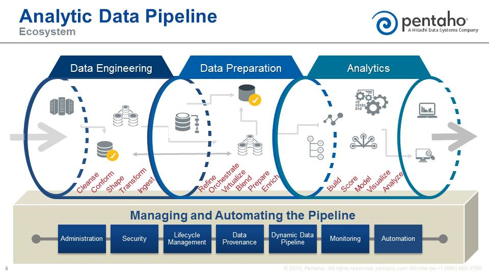

```{r}


#Link: https://www.google.com/search?q=the+data+processing+pipeline&rlz=1C1GGRV_enDE813DE813&source=lnms&tbm=isch&sa=X&ved=0ahUKEwiE64CR6b_fAhXGdCwKHRhlCecQ_AUIDigB&biw=1366&bih=617#imgdii=H1DvabcYs-D1wM:&imgrc=wj9EOAJ47u1rkM:


```


Data Quality & Integration is Time Consuming (Popular phrase: fast 80% of data analytics time consuming)

* Duplicate values & typos
* Multi-value cells
* Data in wrong field
* Missing / Partial Values
* Encoding Errors
* Change formats (text, number, date)
* Flat to relational data sets
* Schema allignment
* Transpose rows and columns
* Join data sets
* Enrichment from other sources (MDM, API calls)


Data Quality & Integration Solutions


```{r}


#Link: https://courses.cognitiveclass.ai/courses/course-v1:BigDataUniversity+DP0101EN+2016/courseware/979efca08061457fb8238554799a17ab/3e67bdd387594e6a83f0120aef7b6e44/


```

Conclusion about Data Quality & Integration with OpenRefine.

> In today's fast-paced data environment, data engineers, scientists, and analysts are rare and can't keep pace with the volume of requests. Domain experts are limited by the spreadsheet software functionality.Open Refine empowers domain experts to work on their own data via self service data preparation solution that addresses the skill gap


**Moving toward and agile data process:**


```{r}


#Link: https://courses.cognitiveclass.ai/courses/course-v1:BigDataUniversity+DP0101EN+2016/courseware/979efca08061457fb8238554799a17ab/3e67bdd387594e6a83f0120aef7b6e44/


```

Conclusion about Agile Data Process with OpenRefine.

>OpenRefine is a powerful interface for Subject Matters Experts, allowing Business Analysts and Consultants to discover, normalize, and enrich their data with only limited technical knowledge. OpenRefine addresses the skill gap between domain and data experts. Domain experts drive the data process from discovery to preparation while data engineers provide expertise through scaling key process


**OpenRefine history and community:**

* Gridworks era 2009 - 2010 from MetaWeb Inc. (Gridworks is open source under the BSD license)

* Google acquires MetaWeb Inc. in 2010 and Gridworks is rebranden as Google Refine

* Google Refine 2.0 is released in 2010

* Google Refine 2.5 is released in 2011

* In November 2012: Google stoppped supporting Google Refine, opening the project to the community. The Community moved the project to Github and rebranded it as OpenRefine

* In 2013 OpenRefine2.6-beta is released


```{r}


#Link: https://sites.temple.edu/tudsc/2016/12/13/preparing-data-with-openrefine-part-ii-assign-unique-numerical-identifiers/


```


```{r}


#Link: https://courses.cognitiveclass.ai/courses/course-v1:BigDataUniversity+DP0101EN+2016/courseware/979efca08061457fb8238554799a17ab/3e67bdd387594e6a83f0120aef7b6e44/


```


**OpenRefine interface tour:**

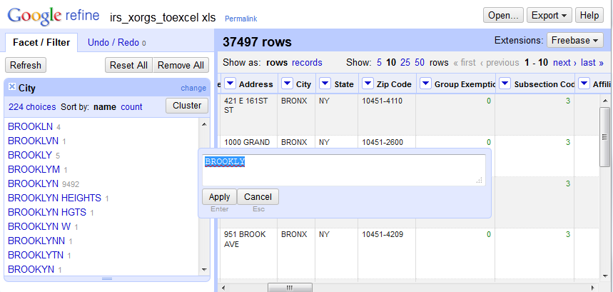


```{r}


#Link: https://journal.code4lib.org/articles/9652


```


**Installing OpenRefine: **

For Windows->

* Go to the OpenRefine download page-> [http://openrefine.org/download.html](http://openrefine.org/download.html)
* Click on Windows kit to download the install file
* To use it, unzip, and double-click on google-refine.exe (if you're having issues with google-refine.exe try refine.bat instead)
* Google Refine will then open in your web browser.
* If it doesn't open automatically, open a web broswer after you've started the program and go to the URL http://localhost:3333 and you should see OpenRefine (with chrome or firefox).

For Mac->

* Download the DMG file.
* Open the disk image and drag the OpenRefine icon into the Applications folder.
* Double-click on the icon to start OpenRefine.

For Linux->

* Download the gzipped tarball.
* Extract the folder to your home directory.
* In a terminal, enter ./refine to start.

Note: OpenRefine will allocate only 1 GB of RAM. For more capacity see the another explanation about "for more memory".


**Creating a new project:** 

The start screen of OpenRefine.
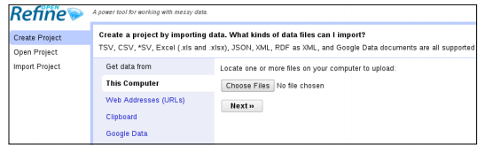

```{r}

# Link: http://file.allitebooks.com/20151012/Using%20OpenRefine.pdf

```

**Create Project** from different sources.

* This Computer: Select a file stored on your local machine
* Web Addresses (URLs): Import data directly from an online source
* Clipboard: Copy-paste your data into a text field
* Google Data: Enable access to a Google Spreadsheet or Fusion Table

**Open Project:** Previous Project

**Import Project:** Open the Project

File formats supported by OpenRefine:

* Comma-Separated Values (CSV), Tab-Separated Values (TSV), and other *SV
* MS Excel documents (both .XLS and .XLSX) and Open Document Format
(ODF) spreadsheets (.ODS), although the latter is not explicitly mentioned
* JavaScript Object Notation (JSON)
* XML and Resource Description Framework (RDF) as XML
* Line-based formats (logs)

> If you need other formats, you can add them by way of OpenRefine extensions.

OpenRefine consists of three simple steps: selecting your file , previewing the import, and validating. The setting for validating step is in the following screenshot.

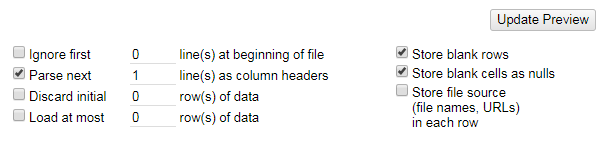


**Exploring the data: **

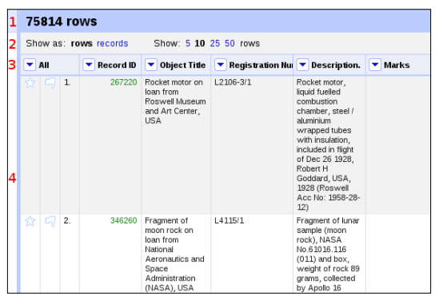

```{r}

#http://file.allitebooks.com/20151012/Using%20OpenRefine.pdf


```

1. Total number of rows
2. Display options
3. Column headers and menus
4. Cell contents:
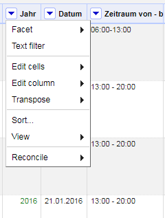

**Manipulating columns: **

* Collapsing and expanding columns:  View | Collapse all other columns on the column Categories.
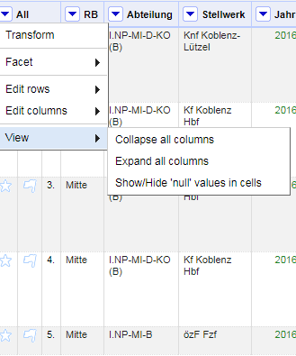

* Moving columns around: The View option offers a quick way to collapse or expand all columns, while Edit columns | Re-order / remove columns...  
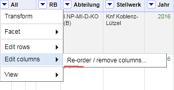

* Renaming and removing columns: Under the same Edit column menu item.
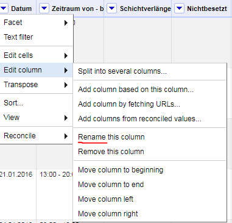

**Project history: **

Click on the Undo / Redo tab or extracted in JSON format by clicking on
the Extract... button just under Undo / Redo. 

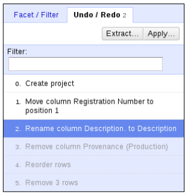

```{r}

#http://file.allitebooks.com/20151012/Using%20OpenRefine.pdf


```

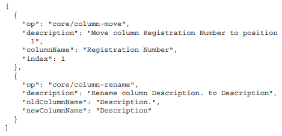

```{r}

#http://file.allitebooks.com/20151012/Using%20OpenRefine.pdf


```

**Exporting a project: **

The Export menu in the top-right of the screen allows you to do just that:
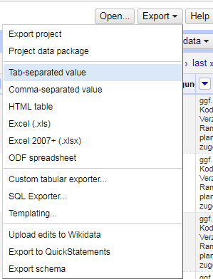


Some of choice are:

* Export project
* HTML table
* Triple loader and MQLWrite
* Custom tabular exporter and templating
* Templating

**For more memory: **

* Windows

On Windows, you will have to edit the `openrefine.l4j.ini` file in OpenRefine's
main folder. Find the line that starts with -Xmx (which is Java speak for "maximum
heap size"), which will show the default allocated memory: 1024M (meaning 1024 MB
or 1 GB). Increase this as you see fit, for instance to 2048 M. The new settings will be in effect the next time you start OpenRefine.

* Mac

The instructions for Mac are a bit more complicated, as this operating system hides the
configuration files from sight. After closing OpenRefine, hold control and click on its
icon, selecting Show package contents from the pop-up menu. Then, open the `info. plist` file from the `Contents` folder. You should now see a list of OpenRefine settings.
Navigate to the Java settings and edit the value of `VMOptions` (these are the properties
of the Java Virtual Machine). Look for the part that starts with -Xmx and change its
default value of 1024 M to the desired amount of memory, for instance, `-Xmx2048M`.

* Linux

This might come in as a surprise, but increasing allocated memory is easiest in Linux.
Instead of starting OpenRefine with ./refine as you usually would do, just type in
´./refine -m 2048M`, where 2048 is the desired amount of memory in MB. To make
the change permanent, you can create an alias in the hidden `.bashrc` file located in
your home folder by adding the following line at the end of the file:

`alias refine='cd path_to_refine ; ./refine -m 2048M'`

Here, path_to_refine is the relative path from your home folder to the OpenRefine
folder. Then, the next time you start OpenRefine with `./refine`, it will be allocated
2 GB by default.


<Br>

#2. Key features

**Learning Objectives:**

* Importing data
* Sorting data
* Faceting data (augmented)
* Detecting duplicates
* Applying a text filter
* Using simple cell transformations
* Removing matching rows

##_Importing data

Get the data from various external
sources.  It has two parts; 1. Creation of Project and 2. Parsing Datas    

**1. Creation of Project:**

Navigation->

  * OpenRefine
  * Click on "Create Proeject"
  * Select from the list the sheet or data 
  * Click on Choose File
  * Next and Create Project 

Steps->

  * Open Google Refine
  * Click on Choose File to browse through your documents and to select the particular
    document to play with.
  * You can even choose a website, or from your clipboard, or even google data.
  * Click on Next 
  * The file is uploaded.
  * Give a name to the project, and click on create project
  
Sopporting format are TSV, CSV, *SV, .xls, .xlsx, JSON, XML,
RDF as XML and google documents.


**2. Parsing Data: **

Parsing the Data such as the number of rows, blank rows etc. 

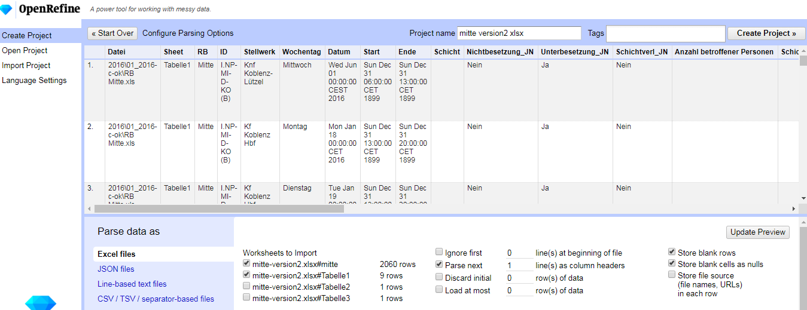


##_Sorting data

The Sort menu appearing at the top every columns as shown in the following screenshot:

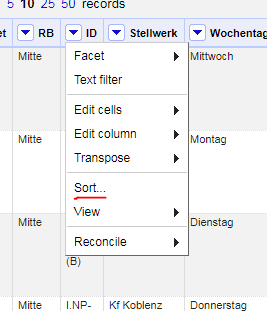

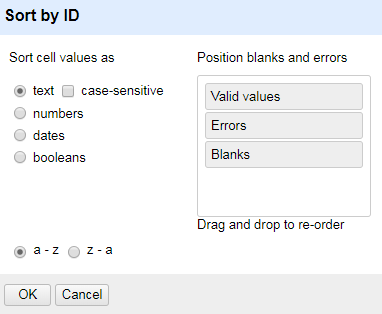


##_Faceting/filtering data

It is a method to filter data into subsets. Facets also allow you to apply
a transformation to a subset of your data for text, number and dates.

**Types of facets/filtering:**

1. Text:  It shows number of rows for each group and gives a larger picture of data.
Text facets can be applied on several columns. `Facet-> Text facet`

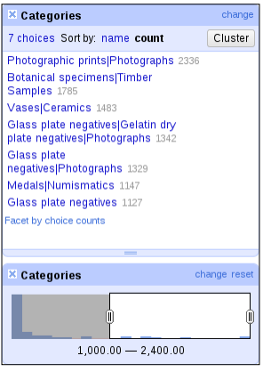

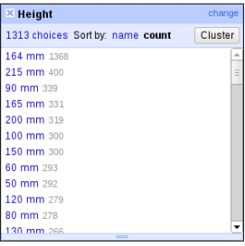

```{r}

#Link: http://file.allitebooks.com/20151012/Using%20OpenRefine.pdf

```


2. Numeric: 
This facet groups numbers into numeric range bins. Then we can select any
range for use showing consecutive numbers

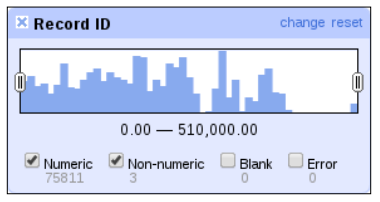

```{r}

#Link: http://file.allitebooks.com/20151012/Using%20OpenRefine.pdf

```


Before moving to customized facets, let's quickly mention two other ways for
faceting that are related to the numeric facet: the timeline facet and scatterplot facet.

A timeline facet requires dates, so text strings such as 17/10/1890 need to be
converted to the date format first. You can try that on the Production Date column,
but notice that real dates are a minority, since it also contains years such as 1984 and
ranges such as 2006 to 2007. We can nonetheless navigate to Edit cells | Common
transforms | To date in that column menu, transforming 79 cells into date format;
for instance, 17/10/1890 will be converted to 1890-10-17T00:00:00Z, with the zeros
indicating the time of day in hours, minutes, and seconds.

Clearly, 79 cells out of a total of 75,814 is not a lot, but a timeline facet on these
values would still show objects created on a given date range from 26 February,
1880 to 31 January, 1952, while most values are either not time expressions (19,820)
or blank (55,915).

The following screenshot shows what can be obtained with a timeline facet on the
Production Date column after converting dates to OpenRefine's internal time format:

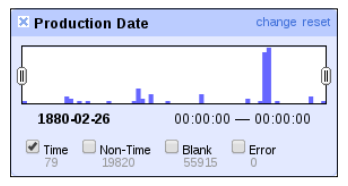

```{r}

#Link: http://file.allitebooks.com/20151012/Using%20OpenRefine.pdf

```


3. Custom Text Facet:
This is a text facet in which you can split the column data using
expression `(value.split("")[0])` without creating new column. Groups will be made
according to spilt data sorted by their counts.

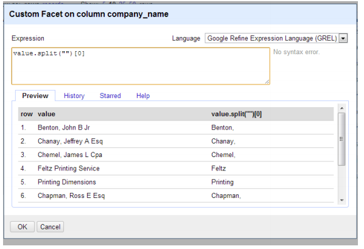

```{r}

#Link: https://casci.umd.edu/wp-content/uploads/2013/12/OpenRefine-tutorial-v1.5.pdf

```


4. Custom Numerical Facets: 
This facet allows you to customize the numeric facets. The
numeric values can be grouped by their logs, modulus, length of string etc.
This methoden need GREL (General Refine Expression Language)


5. Customized facets:
There are various types of customizable facets. They include Word
Facet, Duplicate Facets, Numeric log facet, 1- bounded numeric log facet, text length
facet, Log of text length facet, Unicode char-code facet, Facet by error, Facet by Blank.

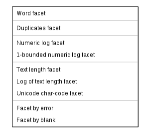

```{r}

#Link: http://file.allitebooks.com/20151012/Using%20OpenRefine.pdf

```


6. Faceting by star or flag:
Stars can be used to mark good
rows or favorite rows that you want to pick up in order to come back to them later;
conversely, flags can be used to indicate bad rows or problematic rows that will need
special attention further on. Note that this is just a suggestion; you could use stars
and flags to mean something completely different.


##_Editing Cells/Columns/ Rows

###1. Editing cells by using common Transforms: 
The navigation for these functions is edit cells, Common Transform. Some of them are for removing whitespaces, applying capitalization styles and
to convert the data into the desired data type.

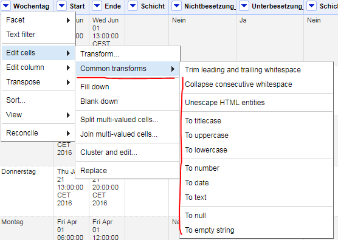

```{r}

#Link: http://file.allitebooks.com/20151012/Using%20OpenRefine.pdf

```


###2. Transforming Data extraction from existing column:

Suppose if we have uploaded text file for all students of UMD consisting of their courses,
year, age etc. then we can extract year or any other data to make a new column for easy
usage. New column can be made from existing columns. 

A) Navigation

Edit Cells , ???Transform

B) Steps

We can remove space or any other unwanted symbols from the data too. Imported text file.
The text file had some blank rows but while importing text file, we can select option not to store blank rows and it filters the data while creating project only.

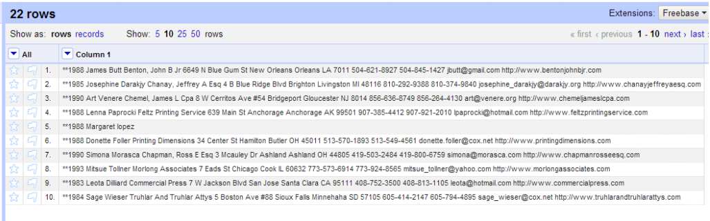

```{r}

#Link: https://casci.umd.edu/wp-content/uploads/2013/12/OpenRefine-tutorial-v1.5.pdf

```


  * 1) Using the expression value.replace("**","") to remove double stars.
  
  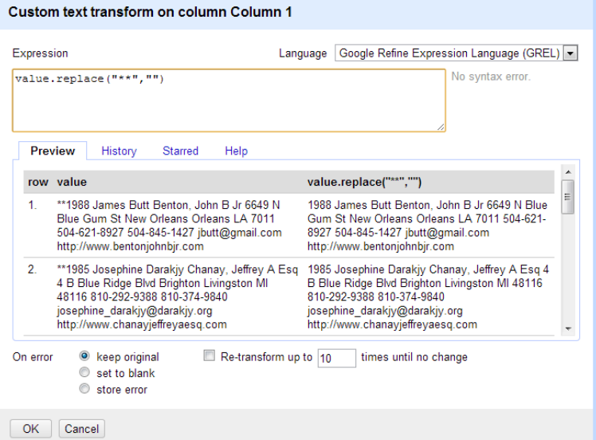

```{r}

#Link: https://casci.umd.edu/wp-content/uploads/2013/12/OpenRefine-tutorial-v1.5.pdf

```
  
  * 2) To remove year prefixed, select option "add column based on this column"
  
   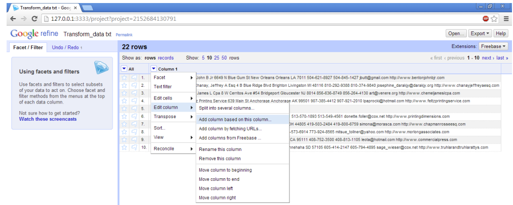

```{r}

#Link: https://casci.umd.edu/wp-content/uploads/2013/12/OpenRefine-tutorial-v1.5.pdf

```
  
  * 3) Use expression value[1,5] which specifies the character range to separate years as        below
  
  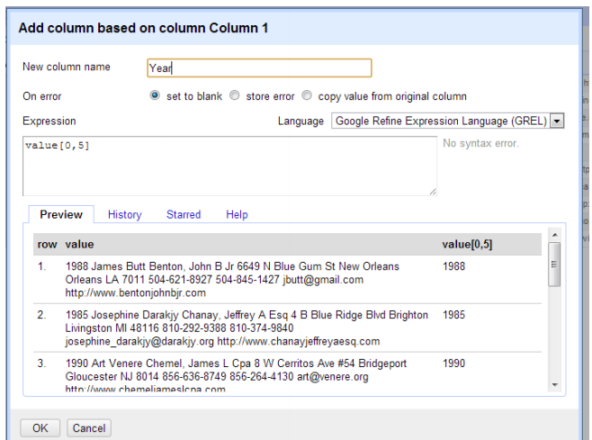

```{r}

#Link: https://casci.umd.edu/wp-content/uploads/2013/12/OpenRefine-tutorial-v1.5.pdf

```

  * 4) Using character string "value.substring(5)" which displays the data excluding year

 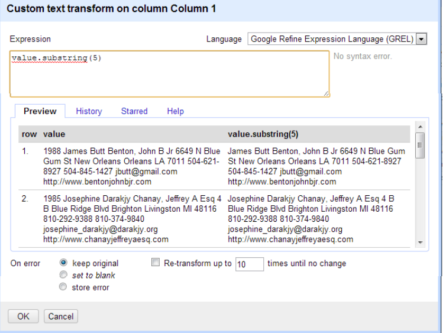

```{r}

#Link: https://casci.umd.edu/wp-content/uploads/2013/12/OpenRefine-tutorial-v1.5.pdf

```


###3. Understanding Expressions: 

OpenRefine support 'Expressions'. And these are used to
transform existing data or create new data based on existing data .This sounds similar to the 'Formula' which we used to have in Excel. But there is a big difference between them. The 'Formula' in the Excel can only be used to store various formulae for each cell for that specific column. Whereas, in Expressions, here by making use of "GREL", we can access every row and column and can set up conditions according to that.click edit Cells , Transform.

Function 1: value + " (string)"

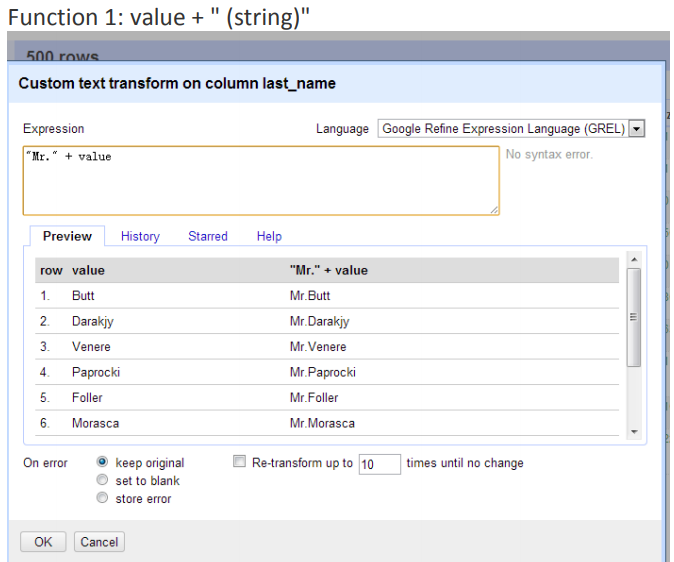

```{r}

#Link: https://casci.umd.edu/wp-content/uploads/2013/12/OpenRefine-tutorial-v1.5.pdf

```

Function 2: value.trim().length() 

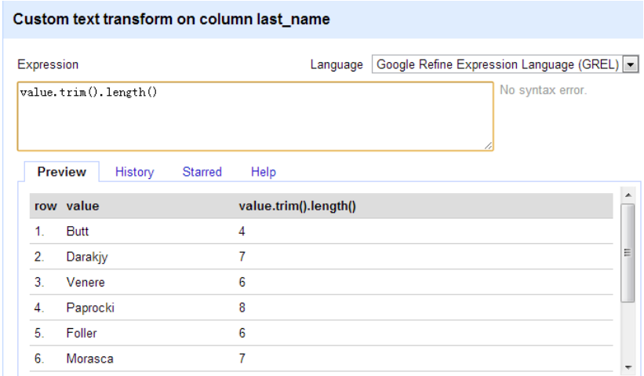

```{r}

#Link: https://casci.umd.edu/wp-content/uploads/2013/12/OpenRefine-tutorial-v1.5.pdf

```


Some Functions at a Glance:

1) Syntax: - "Mr." + value
Explanation: - used to concatenate two strings

2) Syntax: - value + 3.9
Explanation:-add two numbers, and if the value other than numbers, then it concatenates
string

3) Syntax: - value.trim().length()
Explanation:-trims the leading and trailing whitespace

4) Syntax: - value.substring(0,3)
Explanation: - take the substring of value from character index 0 up to and excluding
character index 3


##_Detecting duplicates

Duplicates are annoying records that happen to appear twice (or
more) in a dataset. 

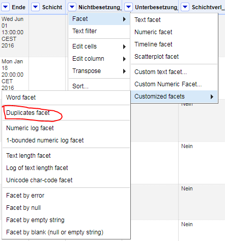

##_applying a text filter

When you want to find rows matching a certain string, it is easier to rely on a simple
text filter than on cumbersome facets. 

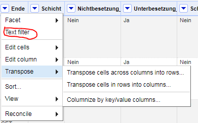

##_Removing matching rows

To remove rows, be sure to have a facet or filter in place first, otherwise you will
remove all rows in the dataset.

Let's start from the clean project again (import it for a second time or toggle the Undo / Redo tab and select 0. Create project to cancel all modifications) and see what we can do to clean up this dataset. Also, check that OpenRefine shows your data as rows, not records.

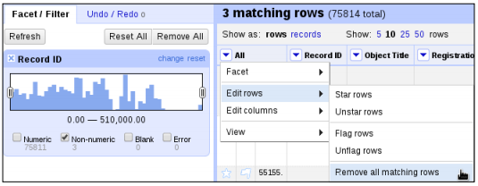

```{r}

#Link: http://file.allitebooks.com/20151012/Using%20OpenRefine.pdf

```


##_Exporting data

Export data from an existing OpenRefine project in several formats:

* Tab separated values (TSV)
* Comma separated values (CSV)
* Excel
* HTML table

Just click on the Export button at the top right corner and select the format that we want. 

##_Undo/ Redo

The flexibility to make mistakes and to rectify them. Gives you an opportunity to make a lot of trials and error on data. 

* (i) Before Undo/Redo

Here, you can see that on the left side of the panel, there are five steps which have been
performed by the user .Out of which, the last one is greyed. The greyed step number 5
explains that Undo has already been performed once. To prove this point, we perform
'Undo' once again.

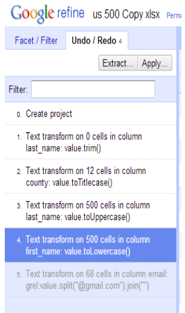

```{r}

#Link: https://casci.umd.edu/wp-content/uploads/2013/12/OpenRefine-tutorial-v1.5.pdf

```


* (ii) After Undo/Redo

Here, you can see the same five steps with two greyed steps: step number 4 and step
number 5.Here, we can see that the Undo function is performed and you can also see the
data being altered to the previous step; which is making the first alphabet of the 'first_name
' column capital.

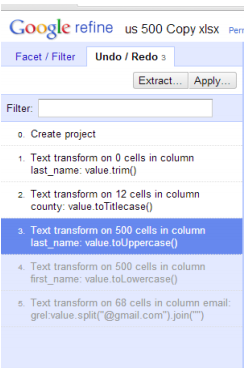

```{r}

#Link: https://casci.umd.edu/wp-content/uploads/2013/12/OpenRefine-tutorial-v1.5.pdf

```

<Br>

#3. Advanced features

##_Handling multi-valued cells-rows

Use case: 

Cevi Herdian, 017632811289, 017632811288

We have one Person with 2 different phone number. We want just the right one.

1. Edit cells, Split Multiple cells with separator `,`

Cevi Herdian

017632811289

017632811288

2. We have 3 row now. And then we go to number or text facet (if a number or text) and make the right one. After that the wrong number will delete and the rest is like this:

Cevi Herdian

017632811289

3. Finally, make sure this two rows in one cells again with join multi valued cells. And the final version of the person and the phone number are Cevi Herdian, 017632811289

More info about splitting values in OpenRefine: https://guides.library.illinois.edu/openrefine/splitting

##_Alternating between rows and
records mode

> A row is a single line of data in your dataset.
A record consists of all rows that belong to a single object.
The first row of a record starts with non-null cells that
identify the record; in subsequent rows, those identifying
values are blank to indicate they belong to the same record.

> Matching records that fit multiple criteria
What if we want to match all records that are in the category Numismatics
and also in the category Medals? To do this, we make sure that we are in
records mode and we add a second text facet on the Categories field. In
the first facet, we select Numismatics, and in the second facet, we select
Medals. We now see all the records that are in both categories.
Now what happens if we switch back to rows mode? Suddenly, zero
records are matching our selection. This seems strange at first, but it is
actually pretty logical: no single row has a category which is equal to
Numismatics and Medals at the same time; each row contains at most
one of these two. Therefore, complex selections such as this one should be
made in records mode.


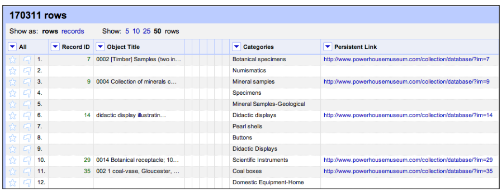

```{r}

#Link:http://file.allitebooks.com/20151012/Using%20OpenRefine.pdf

```

##_Clustering similar cells

Edit cells | Cluster and edit

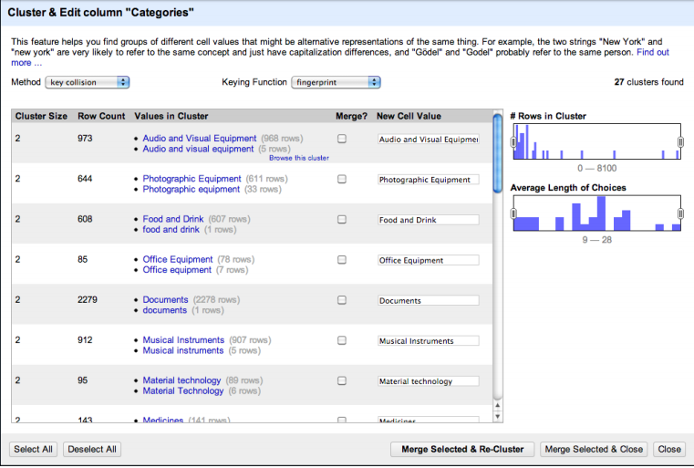

```{r}

#Link:http://file.allitebooks.com/20151012/Using%20OpenRefine.pdf

```

> What are clustering methods?
OpenRefine offers two different clustering methods, key collision
and nearest neighbor, which fundamentally differ in how they
function. With key collision, the idea is that a keying function is used
to map a field value to a certain key. Values that are mapped to the
same key are placed inside the same cluster. For instance, suppose we
have a keying function which removes all spaces; then, A B C, AB C,
and ABC will be mapped to the same key: ABC. In practice, the keying
functions are constructed in a more sophisticated and helpful way.
Nearest neighbor, on the other hand, is a technique in which each
unique value is compared to every other unique value using a
distance function. For instance, if we count every modification as
one unit, the distance between Boot and Bots is 2: one addition
and one deletion. This corresponds to an actual distance function in
OpenRefine, namely levenshtein.


##_Transforming cell values

Edit cells | Transform

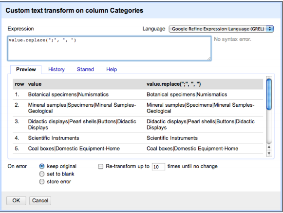

```{r}

#Link:http://file.allitebooks.com/20151012/Using%20OpenRefine.pdf

```
 
The heart of this dialog is Expression, a small script that explains OpenRefine how
each of the values should change. The Language list allows us to choose the language
for the expression, with current support for the General Refine Expression Language
(GREL), Jython (Python implemented in Java), and Clojure (a functional language
that resembles Lisp). If you are familiar with the latter two, you might find it easier to
write expressions in those languages. However, GREL was specifically created with
simple transformations in mind
 
> Mastering GREL is easy
This recipe introduced a few examples, but what if
that doesn't fulfill your needs? Appendix A, Regular
Expressions and GREL will introduce you to GREL so
you can learn how to build expressions yourself.

##_Adding derived columns

1. Edit column and Add column based on this column.

2. Write the GREL expression


##_Splitting data across columns

Edit column | Split into several columns.

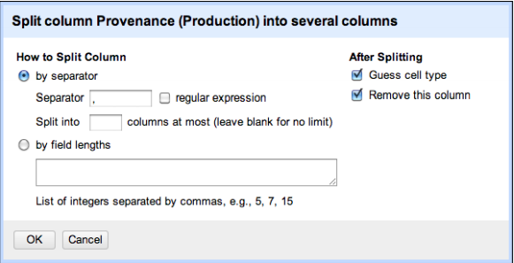

```{r}

#Link:http://file.allitebooks.com/20151012/Using%20OpenRefine.pdf

```


##_ Transposing rows and columns

Transpose | Transpose cells across columns into rows

Edit column | Split into several columns.

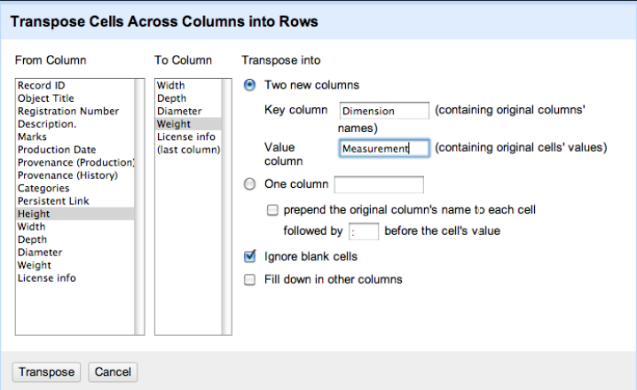

```{r}

#Link:http://file.allitebooks.com/20151012/Using%20OpenRefine.pdf

```

<Br>

#4. Linking data

#_Reconciling values with
Freebase

When you want to transform your cell values from simple strings to URLs, different
choices are possible. Some of them are Freebase, Auto-match candidates with high confidence, and reconciliation service provider. 

The Reconciliation feature is used to link text names or values in the columns of your data to database identifiers in various database ID spaces. It helps you to develop Metadata to your data.

To start reconciliation, go to the Categories dropdown and navigate to Reconcile |
Start reconciling.. 

With Freebase:

* Freebase Query-based Reconciliation: This is useful if your column values
are already Freebase IDs (such as /en/solar_system) or GUIDs
(hexadecimal identifiers).

* Freebase Reconciliation Service: This offers a more general approach for
terms that are not necessarily related to Freebase identifiers.

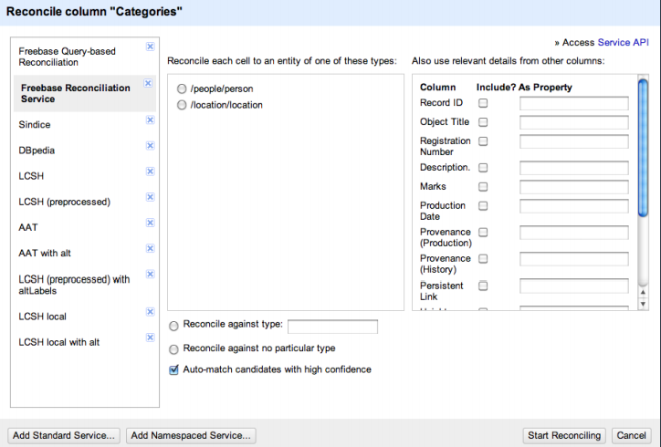

```{r}

#Link:http://file.allitebooks.com/20151012/Using%20OpenRefine.pdf

```


With Auto-match candidates with high confidence:

The auto-match option is on by default, and it
means that if the score is sufficiently high, OpenRefine will assume it has made the
right choice and declare it a match. For other cell values (or if you have unticked the
checkbox), you will have to confirm the match manually. 


The third and final option allows you to send additional data to the reconciliation
service. Please find the reconciliation service that fit for your case.

More about date reconciliation: https://www.experian.co.uk/business/glossary/data-reconciliation/


#_Installing extensions

While OpenRefine allows you out-of-the-box to add new reconciliation services,
these are only services that work in a certain way under the hood.

OpenRefine extensions are available, including the following points:

* The RDF extension by Digital Enterprise Research Institute (DERI), which
adds support for RDF export and reconciliation with SPARQL endpoints.
We'll explain both terms in the next recipe.

* The Named-Entity Recognition (NER) extension written by one of the
authors of this book, which allows you to extract URLs from full-text fields.
Usage of this extension is covered in detail in the last recipe of this chapter

Like OpenRefine, all extensions are available freely. An up-to-date list of available
extensions is maintained at https://github.com/OpenRefine/OpenRefine/wiki/
Extensions

First, you will have to find the path where extensions need to be installed. This
depends on your operating system, but OpenRefine can help you find it. At the
bottom of the starting page, there is a link called Browse workspace directory.

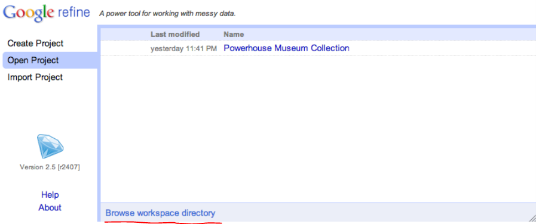

```{r}

#Link:http://file.allitebooks.com/20151012/Using%20OpenRefine.pdf

```


The next step is to download an extension and to place it in the folder. For
instance, let's install the RDF extension. 


Now restart OpenRefine to make the extension active. Then, start OpenRefine again as usual and open a project. When the project has loaded, a new RDF button in the top-right tells you that the installation has been successful:


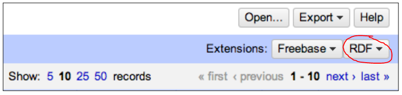

```{r}

#Link:http://file.allitebooks.com/20151012/Using%20OpenRefine.pdf

```


#_Adding a reconciliation service

The Resource Description Framework (RDF) is a model for data that can be
interpreted by machines. While humans can read HTML on the Web, machines do
not understand natural language and must therefore be given information in another
form. 

The SPARQL Protocol and RDF Query Language (a recursive acronym for
SPARQL) is a language for querying RDF datasources. Traditional relational
databases use SQL as a query language; RDF databases and important for us,
reconciliation services, communicate in SPARQL.

When you installed the RDF extension, you already added support for SPARQL to OpenRefine. However,
before we can reconcile our cell values to URLs, we must configure the datasource.
To do this, click on the new RDF button in the top-right and navigate to Add
reconciliation service | Based on SPARQL endpoint.. Note that you can also
reconcile with a local RDF file, which is handy if you have your own dataset of URLs.
OpenRefine shows you the Add SPARQL-based reconciliation service dialog.

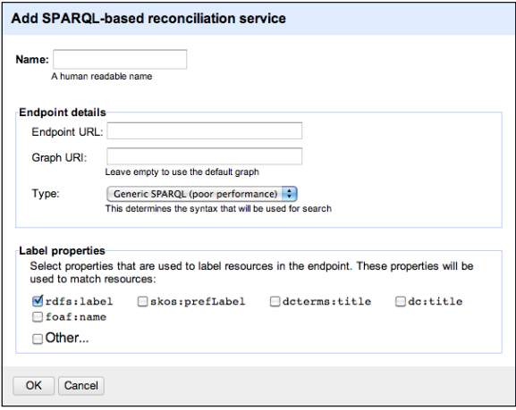

```{r}

#Link:http://file.allitebooks.com/20151012/Using%20OpenRefine.pdf

```

#_Reconciling with Linked Data

Tim Berners-Lee, inventor of the Web and one of the creators
of the Semantic Web vision, realized this and launched the Linked Data principles
(http://www.w3.org/DesignIssues/LinkedData.html). These principles shifted
the focus of the Semantic Web to the creation of data that was interlinked with other
datasets. The principles are as follows:

1. Use URIs as names for things
2. Use HTTP URIs so that people can look up those names
3. When someone looks up a URI, provide useful information using the
standards (RDF, SPARQL)
4. Include links to other URIs so that they can discover more things

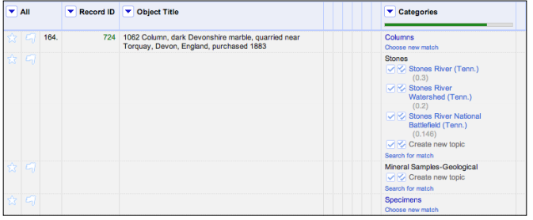

```{r}

#Link:http://file.allitebooks.com/20151012/Using%20OpenRefine.pdf

```


#_Extracting named entities

Reconciliation works great for those fields in your dataset that contain single terms,
such as names of people, countries, or works of art. However, if your column
contains running text, then reconciliation cannot help you, since it can only search
for single terms in the datasets it uses. Fortunately, another technique called
named-entity extraction can help us. An extraction algorithm searches texts
for named entities which are text elements, such as names of persons, locations,
values, organizations, and other widely-known things. In addition to just extracting
the terms, most algorithms also try to perform disambiguation. 


OpenRefine does not support named-entity recognition natively, but the Named-Entity
Recognition extension adds this for you. Before continuing with this recipe, download
the extension from http://software.freeyourmetadata.org/ner-extension/ and
follow the Installing extensions recipe. If the installation was successful, you are greeted
by the Named-entity recognition button in the top-right of your screen after restarting
OpenRefine


<Br>

#5. Regular expressions for text patterns


##_Character classes

* The pattern Aar will look for all texts that contain a capital A followed by a
small a and r. If the case sensitive box is not ticked, the capitalization will
not matter.
* The pattern 123 finds all texts that contain this number. Note that texts with
the number 41235 are also matched, since 123 is a textual part of that.
* As you can see, this does not differ from regular text matching yet. With
regular expressions, we can also say that we expect any letter or any number.
We can give a set of characters from which can be chosen by surrounding
the alternatives with square brackets []. We can indicate a character range in
those brackets by separating the limits with a hyphen.
* The pattern [0123456789] matches all texts that contain a number.
* The pattern [0-9] does the same, only it is more condense. It says everything
between 0 and 9 is fine.
* Similarly, the pattern [a-z] matches all lowercase letters (and also uppercase
if the case-sensitive option is not used). [A-Z] matches uppercase letters and
[a-zA-Z] matches all letters, regardless of the case-sensitive option.
* If you want to look for numbers and letters, use [0-9a-zA-Z]. Read this as
"every character between 0 and 9, between a and z, or between A and Z".
* As in the earlier examples, we can put several matchers next to each
other. analy[sz]e will match both American (analyze) and British
(analyse) spellings.
* Similarly, the expression [0-9][a-z] will find numbers directly followed
by at least one letter. The expression [a-z][0-9][0-9][0-9] finds letters
directly followed by at least three numbers.
* If you want to find measurements such as 1 cm or 25 in, you will not
find them with the preceding expressions because of the space in between.
Luckily, a space is also a symbol, so the expression [0-9] [a-z] will find
them. Note the space in between the bracket pairs, and note the fact that
this will even find longer measurements such as 12345 meters. Indeed, the
expression matches a number followed by a space and a letter, so in this case,
5 m. It doesn't matter whether other numbers or letters are also present.
* If you're just looking for measurements in inches, the expression [0-9] in
will do the job.
* It might be a bit cumbersome to write [0-9] in full every time. This is why
shorthand character classes were introduced. They are symbols that stand
for a set of characters. For instance, the symbol \d stands for any digit and is
thus equivalent to [0-9], but a lot faster to write. The opposite is \D, which
means anything that is not a digit and includes letters as well as symbols.
Unfortunately, there is no shorthand for any letter, but there is a shorthand
for any letter, number, or underscore, which is \w, which stands for any word
character. Again, the opposite is \W, which matches for all non-letters and
non-numbers that are not underscores either.
* \d [a-z] will again match for texts with measurements: any number
followed by a space and a letter.
* \d\d\d matches texts with numbers with a length of at least three.
* \D\D matches texts that have at least two consecutive non-numbers. If you're
surprised to see texts with numbers as well, think about it: the expression only
says that the text should contain a non-number followed by a non-number;
it doesn't say that there should be no numbers at all. However, if a text field
only contains numbers, it won't be matched. To rephrase, the expression
means "I'm looking for two non-numbers in a row, do you have them?"
* You might wonder how \D works. Does it then translate to a huge set that
includes everything but numbers? The answer is more simple: using a caret ^
as the first character in braces means none of the characters should be present
in the pattern. Therefore, \D stands for [^0-9].
* The expression [^a-zA-Z0-9] looks for texts that contain something which
is not a letter or number. Most texts will match, as for instance spaces and
punctuation marks are still allowed. However, empty fields will not match,
as there must be at least one character which is not a letter or number.
* The expression [^a-zA-Z0-9]\d[^a-zA-Z0-9] means any digit surrounded
by non-letters or non-numbers. For instance, we see that single digits in
parentheses are matched. Note that items such as (123) will not be matched,
but (3) will, as we explicitly say that it should be a single digit.
* The pattern a.a.a matches any text where an a is followed by any character,
another a, any character, and another a. For instance, texts with the words
dulcamara, alabaster, and salamander will match.
* The pattern 19.. (there is a space before and after) will match years in the
20th century.
* However, you should be careful with the dot: the last pattern also matches
19th and 19M$, because a dot really means anything. If a year is what you
want, 19\d\d is more accurate.
* To find texts that have three consecutive dots in them, use \.\.\.. (This can
actually be done in a more handy way, as we'll see in the next section.)
* To find texts with a backslash, use \\. (There are none in the dataset.)
* Texts that contain an opening or a closing square bracket are found with [\
[\]]. This looks complicated, but it is quite logical: the first and last bracket
say "choose any of the things within". And the things within are actual
square brackets, but they have to be escaped, so they become `\[ and \]`.
* With `[2]`,you find texts that contain the number 2 ("choose any of the things
within", and the only thing within is a 2). With `\[2\]`, you find texts with
the number 2 surrounded in square brackets, as the brackets are escaped this
time and thus have no special meaning anymore.

##_Quantifiers

Quantifiers can express repetition. There are three simple quantifiers: a plus sign +,
which means one or more times, an asterisk *, which means zero or more times, and
a question mark ?, which means zero or one time. They only exert an effect on the
symbol that is directly to the left of them:

* bre+d matches texts that contain bred, breed, or breeed with any number of
e, as long as at least one e is present.
* bre*d matches texts that contain brd, bred, breed, or breeed with any
number of e, even without. Note how brd is matched with the asterisk, but
not with the plus sign.
* bre?d matches brd and bred, but not breed or any other number of es. Put
simply, it makes the e optional.
* Combinations are also possible. br?e+d matches bed, bred, beed, breed,
beeed, breeed, and so on.
* In addition, you can be explicit about the number of times you would like
a symbol to occur by using curly braces {min,max}. You can specify the
minimum and maximum number of times it can occur. Either one can be
empty, in which case there is no minimum or maximum. Leave the comma in
so OpenRefine knows whether you specified the minimum or the maximum.
If you just supply a single number without a comma, the exact number of
times will be matched.
* N\d{5,8}, matches texts that contain a code that starts with N followed by
five, six, seven, or eight digits, and then a comma.
* N\d{5,}, matches texts that contain a code that starts with N, at least five
digits, and then a comma.
* N\d{,8}, matches texts which contain a code that starts with N, at most eight
digits, and then a comma.
* N\d{5}, matches texts which contain a code that starts with N, exactly five
digits, and then a comma. This is equivalent to N\d\d\d\d\d but much more
compact (especially if numbers get large).
* Needless to say, the quantifiers and braces are special symbols, so if you
want to match them literally, you should escape them with a backslash.
For instance, question marks can be matched with \?.


##_Anchors

Sometimes, you don't only want to say how many characters to match, but also
where they should be matched. This is possible with anchors. A caret ^ indicates that
the match should happen at the beginning of a line, while a dollar sign $ indicates
that the match should stop at the end of a line. 

Additionally, we can indicate that the match should begin or
end at a word boundary with the anchor \b:

* ^\d matches all texts that begin with a number.
* \d$ matches all texts that end with a number.
* ^\d.*\d$ matches all texts that begin and end with a number. Read this
expression as: start of the text, a number, zero or more times any character
(the dot), a number, end of the text. If we would use ^\d+$ instead, we
would have all texts that contain only a number (of any length).
* \b\d{3}\b searches for texts that contain at least one number of exactly
three digits, since the \b anchor matches at word boundaries. If the text
contains four-digit numbers but no three-digit numbers, it does not match.
(If we would remove the \b anchors, it would.)
* ^\d{3}\b finds texts that start with a three-digit number.


##_Choices

Square brackets give regular expressions the possibility to choose one of the many characters: [a-z123] searches for texts with at least one lowercase letter or any of the digits 1, 2, and 3. Often, the choices are larger, as they can be several letters or words long. For this, the or operator | was introduced. It works as an OR operator between several alternatives:

* glass|wood|steel will match texts that contain glass, wood, or steel.
* \d+|many|few matches either a number, many or few.
* N\d{5},|N\d{8}, matches either five-digit or eight-digit numbers that start
with an N and end with a comma, but nothing in between (so no six-digit
numbers for instance).

##_Groups

If you want to use quantifiers
on a group of characters instead of on a single character, you have to enclose them
in parentheses ():

* While la+ matches texts that contain la, laa, laaa, and so on, the expression
(la)+ finds texts that contain la, lala, lalala, and so on.
* The expression analyz|se would match texts that contain analyz and texts
that contain se. This is probably not that useful. On the other hand, the
expression analy(z|s)e matches both analyze and analyse. Note that
in this case, this is equivalent to analy[zs]e because the choice consists of
a single letter. However, this would not be the case with analyz(e|ing),
which would match analyze and analyzing.

##_Overview

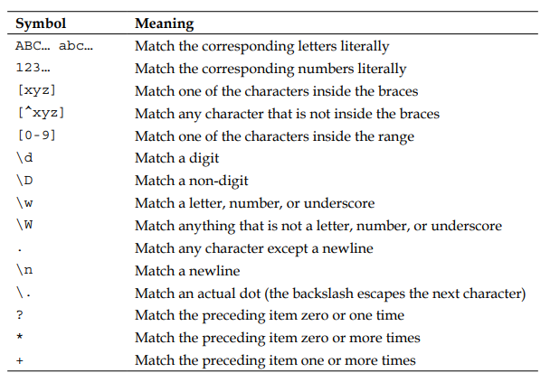

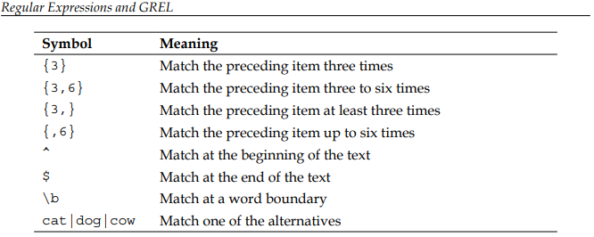

```{r}

#Link:http://file.allitebooks.com/20151012/Using%20OpenRefine.pdf

```


<Br>


#6. General Refine Expression Language (GREL)

##_Transforming data

You can either change cells in-place (by navigating to the respective column dropdown and then to Edit cells | Transform.) or make a new column with the transformed values (by navigating to the respective column dropdown and then to Edit column | Add column based on this column.)

* `"TITLE: " + value + "."`. Adds the text TITLE: before the value and
appends a dot to the end.
* `value.replace("stone", "stones")`. To replace the string stone by stones in each cell
* `value.split("|").length()`. To split the value whenever it encounters a vertical bar, and then uses the length function to count the number of resulting values.
* `value.split("|").uniques().join("|")`. Removes duplicate values from the field.


##_Creating custom facets

Let's create a simple facet by clicking on the Object Title dropdown and navigating
to Facet | Customized Facets | Facet by blank.  

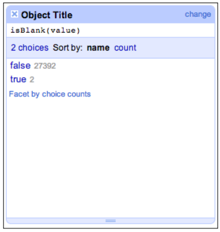

```{r}

#Link:http://file.allitebooks.com/20151012/Using%20OpenRefine.pdf

```

We see that the expression form to fill with GREL 

##_Solving problems with GREL

Also, you'll gain more and more experience with regular expressions and GREL as you gradually begin to master the basics. From that point onwards, it is a small step to the things that are increasingly complex. 

For more information: https://github.com/OpenRefine/OpenRefine/wiki/Understanding-Expressions

<Br>


#Change log update

This Notebook using iterative development. More preferences and revision will be added in the next steps. Below are the timeline change:

* 07.05.2016
* 27.12.2018
* 02.01.2019
* 08.01.2019
* 23.01.2019

<Br>

#Preferences

* [OpenRefine Official](http://openrefine.org/)

* [IBM cognitive class DP0101EN](https://cognitiveclass.ai/courses/introduction-to-openrefine/)

* [Documentation For Users](https://github.com/OpenRefine/OpenRefine/wiki/Documentation-For-Users)

* [Tutorial: OpenRefine University of Maryland](https://casci.umd.edu/wp-content/uploads/2013/12/OpenRefine-tutorial-v1.5.pdf)

* [Wikipedia](https://en.wikipedia.org/wiki/OpenRefine)

* [RefinePro Inc.](http://refinepro.com/)

* [Cleaning Data with OpenRefine, John Little](https://libjohn.github.io/openrefine/)

* [Getting Started with OpenRefine, Thomas Padilla](http://thomaspadilla.org/dataprep/)

* [OpenRefine, Queen`s University](https://accoleds.files.wordpress.com/2015/12/accoleds2015-open_refine.pdf)

* [Using OpenRefine, Max De Wilde](https://www.amazon.com/Using-OpenRefine-Ruben-Verborgh/dp/1783289082)


#License

[MIT](https://opensource.org/licenses/MIT)


